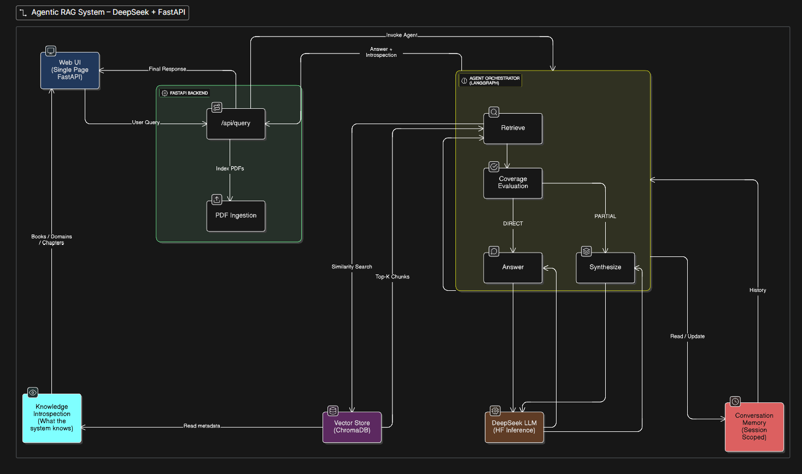

# Agentic RAG System — DeepSeek + FastAPI

A **production-style Agentic Retrieval-Augmented Generation (RAG) system** built with FastAPI, ChromaDB, HuggingFace DeepSeek LLM, and LangGraph.

This project is designed to demonstrate **real AI engineering practices** used in industry — not toy demos.

---

## What This Project Demonstrates

This system goes beyond basic RAG and showcases:

- Robust **PDF ingestion & vectorization**
- **Grounded RAG** (hallucination-aware prompting)
- **Agentic reasoning** using LangGraph
- **Tool introspection** (decision transparency)
- **Conversation memory** (multi-turn context)
- Clean **FastAPI service architecture**
- Simple UI for querying, ingestion, and observability

This mirrors how **production AI backend systems** are built.

---

## High-Level Architecture

