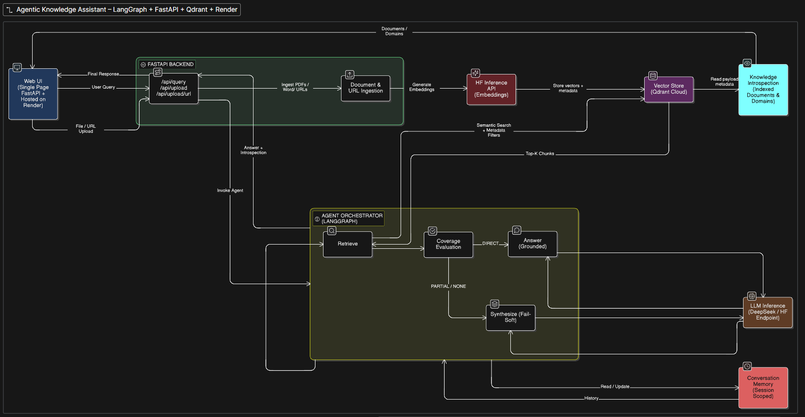
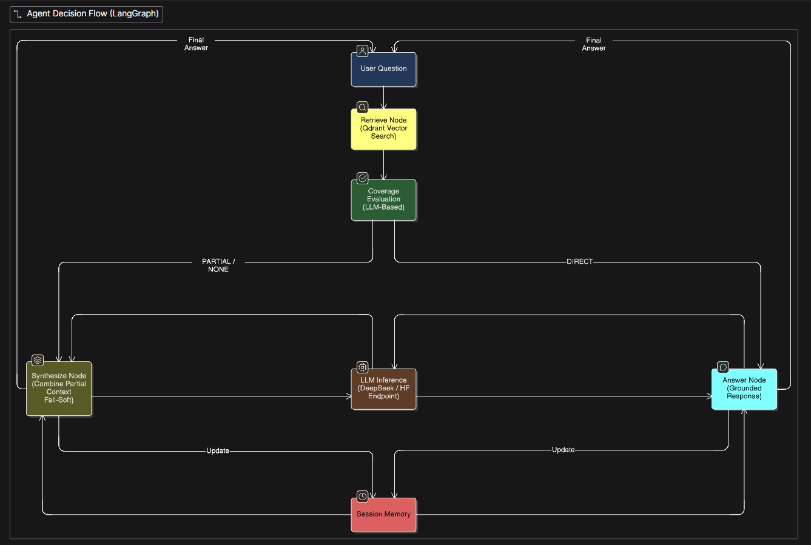

This Project will be updated frequently with new features

Test Application here: - https://personalized-knowledge-assistant.onrender.com
It take few minutes to load the application as server goes to sleep after inactivity. 

<!-- Once server is live kindly provide hugging face token to proceed further. -->
<!-- Creating Hugging Face Token: - https://huggingface.co/settings/tokens  (Create with read access) -->

# Agentic Knowledge Assistant — DeepSeek + FastAPI

This project is a production-style Agentic Knowledge Assistant that combines Retrieval-Augmented Generation (RAG) with agentic decision-making using LangGraph.
Unlike basic RAG demos, this system is designed to behave like a controlled AI agent:
It refuses to hallucinate.
It explains how an answer was produced.
It adapts its reasoning strategy based on context coverage.

---
### Sample Outputs


## What This Project Demonstrates

This system goes beyond standard RAG and showcases:
* Multi-format ingestion (PDFs + live web URLs)
* Intelligent chunking with deduplication
* Cloud-hosted vector storage (Qdrant Cloud)
* Metadata-indexed retrieval (document-level & domain-level filtering)
* Agentic reasoning using LangGraph
* Hallucination-aware answering
* Transparent agent introspection
* Session-scoped conversation memory
- **LLM-as-judge RAG evaluation** (faithfulness + answer relevancy)
---

## High-Level Architecture



---

## Core Components

### Ingestion & Vectorization
The system supports ingesting:
- PDFs
- DOCX / text files
- Live web URLs (HTML parsed via BeautifulSoup)
## Processing pipeline:
- Content extraction.
- Chapter/section detection.
- Recursive chunking
- Deduplication using content hashing
- Embedding via Hugging Face Inference API
- Storage in Qdrant Cloud
- Each chunk is stored with rich metadata:
  - document_id
  - document_name
  - domain
  - source (upload / url)
  - chapter
  - content_hash
- Payload indexes are created in Qdrant for:
  - metadata.document_id
  - metadata.domain
This enables precise filtering without scanning the full vector space.

**Key files**
- `rag_engine.py`
- `ingestion_service.py`
- `vector_store.py`
- `settings.py`

---

### Retrieval-Augmented Generation (RAG)
- Semantic similarity search using Qdrant
- Optional filters:
  - domain-specific
  - document-specific
  - Retrieved chunks are passed
- The LLM is explicitly constrained to use only retrieved context
- If relevant information is missing, the system fails safely instead of hallucinating.

**Key file**
- `llm_service.py`

---

### Agentic Reasoning (LangGraph)

Instead of a linear pipeline, the system uses an **agent** that:

- Retrieves relevant chunks
- Evaluates **coverage quality**
- Chooses an execution path:
  - `answer` → direct answer
  - `synthesize` → merge partial information

This prevents hallucination while preserving answer quality.

**Key file**
- `agent_service.py`

---

### Agent Decision Flow
The agent **never blocks answers** — it only changes *how* the answer is generated.

---

### Tool Introspection (Observability)
For every query, the system exposes:
- `coverage`: DIRECT / PARTIAL
- `path_taken`: answer / synthesize

This is visible via:
- API response
- UI

This makes agent behavior **transparent and debuggable**.

---

### Conversation Memory
- Session-scoped memory
- Short-term (last N turns)
- Used only for reasoning continuity
- **Never embedded or stored in vector DB**

Enables:
- Follow-up questions
- Progressive explanations
- Reduced repetition

**Key file**
- `memory_service.py`

---

## User Interface
Single-page FastAPI UI provides:
- File and URL ingestion
- Domain selection
- Ask-about-this-document mode
- Global knowledge querying
- Agent introspection visibility
- Session persistence

**Key file**
- `ui.py`

---

### Deployment & Production Learnings
- Deployed on Render with GitHub-based CI/CD
- Migrated from local ChromaDB to Qdrant Cloud to overcome memory limits
- Switched to remote Hugging Face embeddings to reduce server RAM usage
- Implemented payload indexing to support filtered vector search
- Resolved multiple issues that only surfaced in cloud deployment:
  - Out Of Memory errors
  - Missing payload indexes
  - Inference latency

---


### RAG Evaluation — LLM-as-Judge
 
The system includes a built-in evaluation pipeline that measures answer quality
using **DeepSeek as the judge LLM** — the same model powering the RAG pipeline itself.
 
Two Ragas-equivalent metrics are computed on any set of test questions:
 
| Metric | What it measures | Target |
|---|---|---|
| **Faithfulness** | Are all claims in the answer grounded in retrieved context? | > 0.85 |
| **Answer Relevancy** | Does the answer actually address what was asked? | > 0.80 |
 
**How it works:**
 
- For each test question, the system runs the full live pipeline — retrieval + agent
- DeepSeek judges each answer against the retrieved context (faithfulness)
- DeepSeek also rates whether the answer addressed the original question (answer relevancy)
- Scores are averaged across all test questions and returned with a pass/needs_review status
 
**Why LLM-as-judge instead of Ragas directly:**
 
Ragas 0.2.x uses Pydantic v2 schemas in its prompts which are incompatible with
open-source models like DeepSeek — the model echoes the schema instead of filling it.
This implementation uses the same scoring logic as Ragas internally, bypassing the
dependency conflict while keeping the evaluation concept identical.
 
**Key file**
- `eval_service.py`
 
**API endpoint**
- `POST /api/eval`
 
---

## How to Run

### Install dependencies
```bash

pip install -r requirements.txt
```
 
### Set your HuggingFace token
```bash
export HUGGINGFACEHUB_API_TOKEN=your_token_here 
- **Required finegraned token only**
```
 
### Start the server
```bash
uvicorn app.main:app --reload
```
 
### Run RAG evaluation
Navigate to `http://127.0.0.1:8000`, click **Run RAG Evaluation**, enter test questions
(one per line), and click **Run Evaluation**. Scores are returned in real time.
 
---
 
## Project Structure
 
```
app/
├── main.py               # FastAPI app entry point
├── api.py                # All API endpoints including /eval
├── ui.py                 # Single-page browser UI
├── settings.py           # Config — paths, chunk size, top-k
├── rag_engine.py         # PDF ingestion + semantic retrieval
├── ingestion_service.py  # Multi-format ingestion (PDF/DOCX/TXT/URL)
├── vector_store.py       # ChromaDB + HuggingFace embeddings
├── llm_service.py        # DeepSeek via HF InferenceClient
├── agent_service.py      # LangGraph agentic reasoning pipeline
├── memory_service.py     # Session-scoped conversation memory
└── eval_service.py       # LLM-as-judge RAG evaluation (NEW)
```
