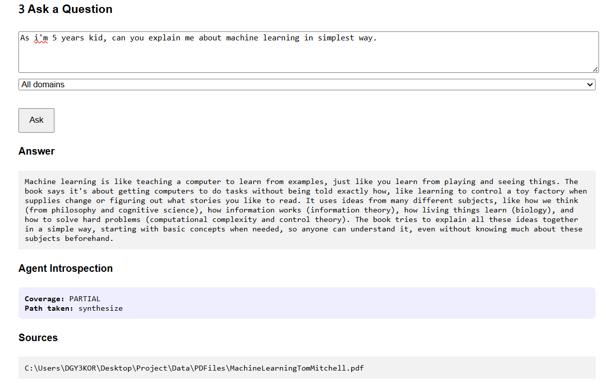
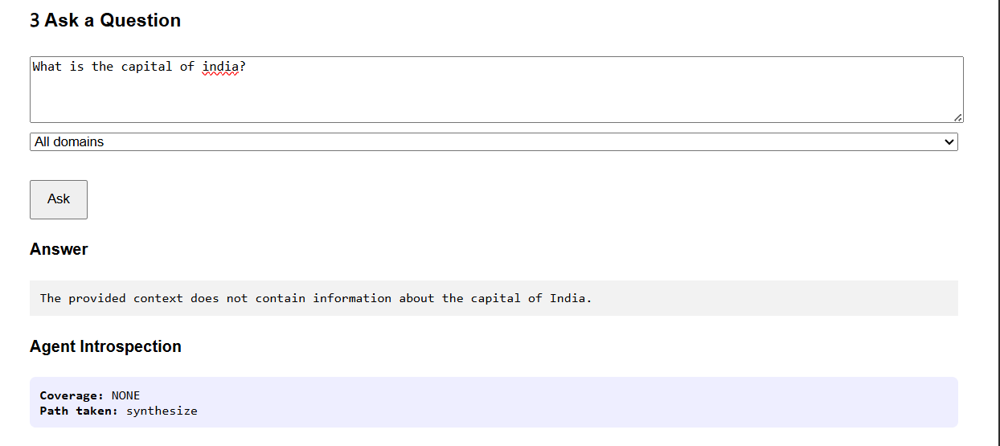
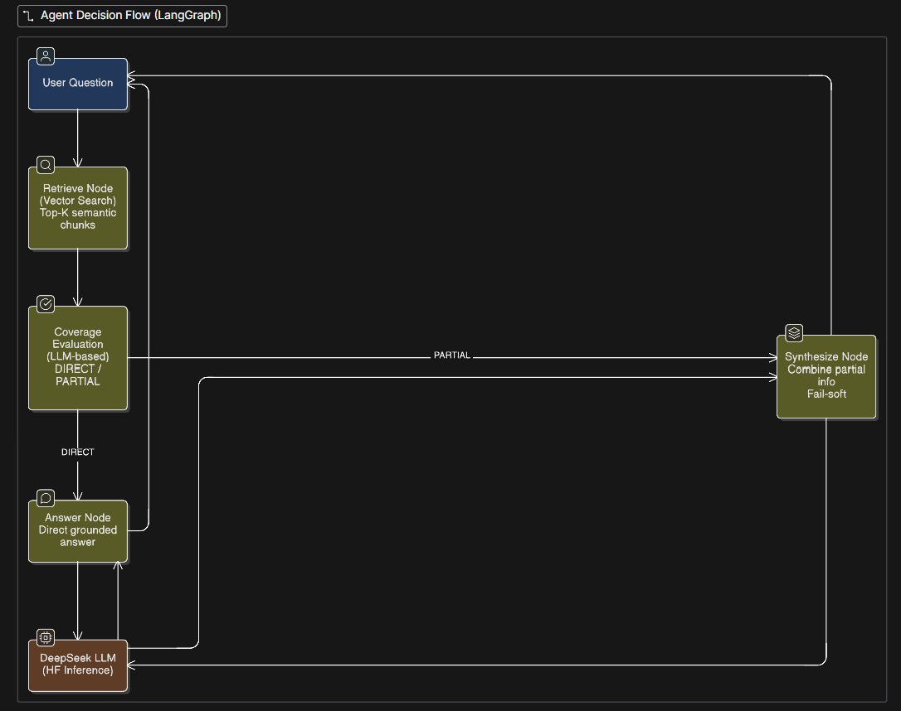

This Project will be updated frequently with new features

Test Application here: - https://personalized-knowledge-assistant.onrender.com
It take few minutes to load the application as server goes to sleep after inactivity. 

Once server is live kindly provide hugging face token to proceed further.
Creating Hugging Face Token: - https://huggingface.co/settings/tokens  (Create with read access)

# Agentic RAG System — DeepSeek + FastAPI

A **production-style Agentic Retrieval-Augmented Generation (RAG) system** built with FastAPI, Qdrant(Cloud storage for vectors), HuggingFace DeepSeek LLM, and LangGraph.

This project is designed to demonstrate **real AI engineering practices**.

---
### Sample Outputs



## What This Project Demonstrates

This system goes beyond basic RAG and showcases:

- Robust **PDF ingestion & vectorization**
- **Grounded RAG** (hallucination-aware prompting)
- **Agentic reasoning** using LangGraph
- **Tool introspection** (decision transparency)
- **Conversation memory** (multi-turn context)
- Clean **FastAPI service architecture**
- Simple UI for querying, ingestion, and observability
---

## High-Level Architecture


---

## Core Components

### Ingestion & Vectorization
- PDFs are parsed, chapter-detected, chunked, and embedded
- Stored in **ChromaDB**
- Deduplication prevents re-indexing
- Metadata includes:
  - book
  - chapter
  - domain
  - source path

**Key files**
- `rag_engine.py`
- `ingestion_service.py`
- `settings.py`

---

### Retrieval-Augmented Generation (RAG)

- Semantic retrieval using embeddings
- Retrieved chunks are passed verbatim
- LLM is **strictly grounded** on retrieved context
- No external knowledge allowed

**Key file**
- `llm_service.py`

---

### Agentic Reasoning (LangGraph)

Instead of a linear pipeline, the system uses an **agent** that:

- Retrieves relevant chunks
- Evaluates **coverage quality**
- Chooses an execution path:
  - `answer` → direct answer
  - `synthesize` → merge partial information

This prevents hallucination while preserving answer quality.

**Key file**
- `agent_service.py`

---

### Agent Decision Flow
The agent **never blocks answers** — it only changes *how* the answer is generated.

---

### Tool Introspection (Observability)

For every query, the system exposes:

- `coverage`: DIRECT / PARTIAL
- `path_taken`: answer / synthesize

This is visible via:
- API response
- UI

This makes agent behavior **transparent and debuggable**.

---

### Conversation Memory

- Session-scoped memory
- Short-term (last N turns)
- Used only for reasoning continuity
- **Never embedded or stored in vector DB**

Enables:
- Follow-up questions
- Progressive explanations
- Reduced repetition

**Key file**
- `memory_service.py`

---

## User Interface

Single-page FastAPI UI provides:

- Ask questions
- Ingest all PDFs
- View knowledge summary
- View agent introspection
- Persistent session handling

**Key file**
- `ui.py`


## How to Run

### Install dependencies
```bash

pip install -r requirements.txt

export HUGGINGFACEHUB_API_TOKEN=your_token_here

Open terminal and write command: - 
uvicorn rag_service.app.main:app --reload
